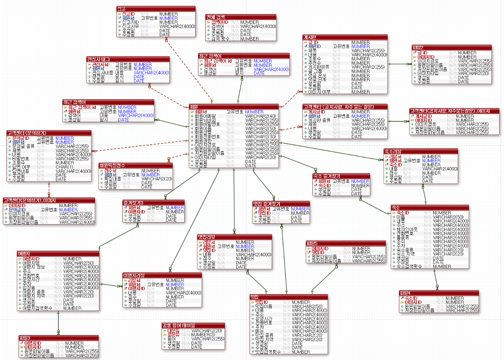

# 나혼자 여행

---

소개         혼자 여행하는 사람들에게 편의를 제공하기 위한 플랫폼 개발 

기술          `Java`  `jsp`  `MyBatis`  `Spring Boot`  `Oracle`  `JPA`

구성          본인 외 6명

일정          2023.04.15 ~ 2023.05.04

<aside>
💡 혼자 여행하는 사람들이 많아지는 시대에 혼자 여행에 필요한 여러 정보를 얻거나 소통을 통해 동행을 구하고 친구를 만나는 종합 웹서비스를 만들고자 진행한 프로젝트입니다.
</aside>

- 로그인을 통해 회원별 정보, 관심사 등 정보 관리가 가능합니다.
- 여행지, 맛집, 숙소 등 혼자 여행에 필요한 여러 정보를 제공합니다.
- 커뮤니티를 통해 여행자들끼리 소통이 가능합니다.
- 종합적인 검색 기능을 제공합니다.
- 관리자 페이지를 통해 관리자가 회원 권한을 관리할 수 있습니다.

깃허브

- [https://github.com/rodminjo/todo-list-webservice](https://github.com/rodminjo/todo-list-webservice)

## 1. 개요

---

- 프로젝트 명칭 : 나혼자 여행
- 개발 인원 : 7명
- 개발 기간 : 2023.04 ~ 2023.05.16
- 담당 역할
    - 스프링 시큐리티를 이용한 자체 회원가입, 로그인, 권한 기능 구현
    - 회원 마이페이지 기능 구현
    - 관리자 페이지 기능 구현
- 주요 기능 :
    - spring security를 이용한 자체 로그인 및 회원별 권한 관리
    - RestApi 를 이용한 커뮤니티 게시글 작성, 수정, 삭제 기능
    - 통합검색, 인기 검색어, 최근 검색어 등 검색 기능
    - 여행지, 맛집, 숙소 정보글 제공
- 개발 언어 : Java 11
- 개발 환경 : SpringBoot 2.7.1, gradle 7.5.1, JPA(Spring Data JPA), Mybatis, Spring Security, JSP
- 데이터베이스 : Oracle
- 형상관리 툴 : GitHub
- 간단 소개 :
    - 혼자 여행하는 사람들에게 유용한 정보와 편리함을 제공하기 위한 종합 여행 가이드 및 커뮤니티 웹서비스

## 2. 요구사항 분석

---

### 1. 로그인 기능

- 스프링 시큐리티를 이용한 자체 로그인 구현
- 로그인 후 이전 페이지로 자동 이동
- 헤더 부분에 현재 로그인 정보 상시 표시
- URL 별 권한관리
- 회원가입
    - 회원가입시 Vaildation 라이브러리 , 커스텀 Validation 을 이용한 닉네임, 이메일 중복 등 유효성 검사 구현
    - 이메일 인증 기능 구현
- 아이디 찾기
    - 회원 이름, 휴대폰 번호를 이용하여 맞는 회원 찾아오기
- 비밀번호 찾기
    - 회원 이름, 휴대폰번호, 아이디 를 이용하여 맞는 회원을 찾아오고 비밀번호 재설정

### 2. 마이페이지

- 회원정보 조회
- 회원 프로필 사진 변경(커스텀, 기본)
- 회원 관심사 추가, 제거 기능
- 회원 정보 변경 기능( 닉네임, 전화번호)
- 회원 활동내역( 내가 작성한 글, 내가 작성한 리뷰, 문의내역, 즐겨찾기) 조회 기능
    - 각 게시판 별 조회 및 즐겨찾기 추가 삭제 기능

### 3. 관리자 페이지

- 회원 정보 조회
- 회원 권한 변경
- 회원 정보 변경

### 4. 여행 / 숙소 / 맛집 페이지

- 각 테마별 기본 정보 조회
- 리뷰 남기기
- 검색, 필터링 기능
- 즐겨찾기

### 5. 커뮤니티 페이지

- 게시글 작성, 수정, 삭제
- 제목, 내용별 검색 기능
- 추천수 필터링

### 6. 고객센터

- 공지사항 글 조회
- 관리자 공지사항 글 작성, 수정, 삭제
- 자주묻는질문 글 조회
- 관리자 자주묻는 질문 작성, 수정, 삭제
- 문의게시판 검색, 카테고리별 분류
- 문의게시판 글 작성, 조회, 수정, 삭제 기능

### 7. 통합 검색

- 여행, 숙소, 맛집, 커뮤니티 검색, 필터링

## 3. DB 설계

---

## 4. API 설계

---

### 메인 API

| 기능 | Method | Url | Return |
| --- | --- | --- | --- |
| 메인페이지 이동 | `GET` | “/” , “/index” | 메인 페이지  |
| 사진 불러오기 | `GET` | /display?file={storedFile} | 저장소에 저장된 사진 반환 |

### 회원 관련 API

| 기능 | Method | Url | Return |
| --- | --- | --- | --- |
| 로그인페이지 이동 | `GET` | /login | 로그인 페이지 |
| 로그인 에러페이지 이동 | `GET` | /login/error | 로그인 에러 페이지 |
| 회원가입 페이지 이동 | `GET` | /join | 회원가입 페이지 |
| 회원가입 요청 처리 | `POST` | /api/v1/join | 이메일, 닉네임중복 및 형식 유효성 검사 후 에러 혹은 가입 완료 페이지 출력 |
| 아이디찾기 페이지 이동 | `GET` | /id | 아이디 찾기 페이지 |
| 아이디 찾기 요청 처리 | `POST` | /api/v1/id | id 확인 페이지 |
| 비밀번호 찾기 페이지 이동 | `GET` | /password | 비밀번호 찾기 페이지 |
| 아이디 찾기 및 비밀번호 변경페이지 이동 | `GET` | /password/info | id 확인 및 비밀번호 변경 페이지 |
| 비밀번호 변경 요청 처리 | `POST` | /api/v1/password/{id} | 비밀번호 변경 요청 처리 |

### 마이페이지 관련 API

| 기능 | Method | Url | Return |
| --- | --- | --- | --- |
| 마이페이지 이동 | `GET` | /mypage | 마이페이지 |
| 마이페이지 내 회원정보 수정창 이동 | `GET` | /mypage/member-info | 회원정보 수정페이지 |
| 마이페이지 프로필 변경창 이동 | `GET` | /mypage/profile | 마이페이지 프로필 변경페이지 |
| 마이페이지 내 회원탈퇴 창 이동 | `GET` | /mypage/withdrawal | 회원탈퇴 페이지 |
| 마이페이지 내 작성리뷰 이동 | `GET` | /mypage/review | 내 작성 리뷰 페이지 |
| 마이페이지 내 문의내역 이동 | `GET` | /mypage/inquire | 내 문의내역 페이지 |
| 마이페이지 내 즐겨찾기 이동 | `GET` | /mypage/favorite | 내 즐겨찾기 조회 |
| 마이페이지 내 관심사 태그 수정창 이동 | `GET` | /mypage/tag | 내 관심사 태그 수정페이지 |
| 마이페이지 회원정보 변경 | `Post` | /api/v1/mypage/info | 마이페이지 회원정보 변경 요청 처리 |
| 마이페이지 프로필 사진 수정 | `Post` | /api/v1/mypage/profile | 마이페이지 프로필 사진 수정 요청 처리 |
| 마이페이지 프로필 사진 기본으로 변경 | `Post` | /api/v1/mypage/profile/normal | 마이페이지 프로필 기본으로 변경 요청 처리 |
| 회원 탈퇴 | `Delete` | /api/v1/mypage/withdrawal | 회원 탈퇴 요청 처리 |
| 마이페이지 즐겨찾기 취소, 재등록 | `Patch` | /api/v1/mypage/favorite | 즐겨찾기 취소, 재등록 요청 처리 |
| 마이페이지 관심사 변경 | `Patch` | /api/v1/mypage/interest | 회원 관심사 변경 요청 처리 |

### 관리자 페이지 관련 API

| 기능 | Method | Url | Return |
| --- | --- | --- | --- |
| 관리자 페이지 이동 | `Get` | /admin | 관리자 페이지 |
| 관리자 페이지 회원권한 변경 | `Patch` | /api/v1/admin/role | 회원 권한 변경 요청 처리 |
| 관리자 페이지 회원 정보 변경창 이동 | `Get` | /admin/info/{id} | 회원정보 변경 페이지 |
| 관리자 페이지 회원 정보 변경 | `Patch` | /api/v1/admin/info | 회원 정보 변경 요청 처리 |

## 5. 기능 명세서

---

| **구분** | **주 기능**                   | **상세 기능**                | **설명**                                                                                                         |
|----------|------------------------------|------------------------------|----------------------------------------------------------------------------------------------------------------|
| **1. 회원 가입** | 1.1 이메일로 회원 가입        |                               | - 새로운 회원일 경우 회원 정보 작성 - 입력한 이메일로 인증 번호가 전송됨 - 인증 번호에 대해 일치 여부 검사         |
| **2. 로그인**    | 2.1 이메일로 로그인           |                               | - 이미 가입한 회원일 경우 로그인, 메인 페이지 이동                                                               |
|              | 2.2 아이디 찾기                 |                               | - 회원 정보 입력 후 일치하는 경우 아이디 확인 가능                                                              |
|              | 2.3 비밀번호 찾기               |                               | - 회원 정보 입력 후 일치하는 경우 비밀번호 변경 요청 페이지로 이동                                               |
| **3. 메인 화면** | 3.1 인기 여행지·숙소·맛집 필터링 | 3.1.1 메인 페이지 검색 시 검색 횟수 카운트 | - 검색 횟수를 기준으로 상위 6개씩 화면에 노출 - 클릭 시 해당 정보 페이지로 이동                              |
|              | 3.2 전체 검색                    | 3.2.1 카테고리별 검색          | - 카테고리별 결과 개수 및 정보 확인 가능 - 여행지·숙소·맛집의 경우 이미지와 함께 화면에 노출 - 클릭 시 해당 정보 페이지로 이동 |
|              |                                | 3.2.2 검색 시 검색어 자동 완성 | - 여행지·숙소·맛집 데이터 중 검색창에 입력한 단어가 포함된 검색어들이 노출                                       |
|              |                                | 3.2.3 인기 검색어               | - 검색 결과 페이지에서 일간·주간·월간별 인기 검색어를 10개씩 노출 - 인기 검색어의 기준은 검색 횟수 - 검색어 클릭 시 자동으로 검색됨 |
|              |                                | 3.2.4 최근 검색어               | - 로그인한 회원의 경우 검색 결과 페이지에서 최근 검색한 검색어가 최대 10개씩 노출 - 검색어 클릭 시 자동으로 검색됨 |
| **4. 게시판**   | 4.1 여행지·숙소·맛집 게시판       | 4.1.1 검색 및 필터링            | - 카테고리별 검색 가능 - 지역별로 정보 조회 가능                                                            |
|              |                                | 4.1.2 리뷰 조회                | - 전체 조회 화면의 경우 지역, 이름, 평점, 리뷰수 노출 - 특정 여행지·숙소·맛집을 클릭할 경우 리뷰를 남긴 회원의 닉네임, 리뷰 내용, 평점, 날짜 확인 가능 |
|              |                                | 4.1.3 리뷰 등록                | - 로그인한 회원의 경우 리뷰 작성 및 평점 매기기, 수정, 삭제 가능 - 비회원이 시도할 경우 로그인 요청 알림창 생성       |
|              |                                | 4.1.4 즐겨찾기                 | - 로그인한 회원의 경우 즐겨찾기 등록 가능 - 즐겨찾기 버튼을 다시 클릭할 경우 즐겨찾기 등록이 취소됨 - 비회원이 시도할 경우 로그인 요청 알림창 생성 |
|              |                                | 4.1.5 관리자 접근 가능 기능     | - 여행지·숙소·맛집 정보 등록, 수정, 삭제 가능한 버튼이 관리자에게만 노출됨                                       |
|              | 4.2 커뮤니티                   | 4.2.1 카테고리별 검색          | - 카테고리별로 검색 가능                                                                                      |
|              |                                | 4.2.2 게시글 조회               | - 최근 등록 순으로 게시글이 노출됨 - 전체 조회 화면에서는 제목, 닉네임, 작성일, 댓글수, 추천수 확인 가능 - 특정 게시글 조회 화면에서는 제목, 닉네임, 작성일, 내용, 추천수, 신고수, 댓글 확인 가능 |
|              |                                | 4.2.3 게시글 작성               | - 글 작성 시 제목, 내용, 이미지 등록 가능 - 자신이 등록한 게시글의 경우 수정 및 삭제 가능                     |
|              |                                | 4.2.4 페이지네이션              | - 페이지당 게시글이 10개씩 노출                                                                                 |
|              |                                | 4.2.5 게시글 필터링             | - 이미지 첨부글만 조회 가능 - 조회수순, 추천순으로 조회 가능                                                |
|              |                                | 4.2.6 게시글 추천               | - 로그인한 회원의 경우 게시글 추천 가능 - 이미 추천한 게시글 클릭 시 취소됨 - 비회원이 추천을 시도할 경우 로그인 페이지로 이동 |
|              |                                | 4.2.7 게시글 신고               | - 로그인한 회원의 경우 글 작성자 혹은 댓글 작성자를 신고 가능 - 신고 시 사유를 선택해야 함 - 이미 신고한 회원을 다시 신고할 경우 "이미 신고한 회원입니다" 알림창 생성 - 비회원이 신고를 시도할 경우 로그인 요청 알림창 생성 - 10번 이상 신고된 경우 "신고당한 글입니다 / 신고당한 댓글입니다" 라고 내용이 변경됨 |
|              |                                | 4.2.8 댓글 등록                | - 로그인한 회원의 경우 게시글에 대해 댓글, 대댓글 등록 가능 - 자신이 등록한 댓글의 경우 수정 및 삭제 가능        |
|              |                                | 4.2.9 투표                    | - 글 작성자의 닉네임 클릭 시 회원 정보를 열람할 수 있고 성향에 대한 선택지에 투표 가능 - 선택지 : 친절해요, 취향이 맞아요 등 |
|              | 4.3 고객센터                   | 4.3.1 카테고리별 검색          | - 카테고리별로 검색 가능                                                                                      |
|              |                                | 4.3.2 문의글 등록               | - 로그인한 회원의 경우 문의글을 작성할 수 있으며 비밀번호를 입력해야 함                                           |
|              |                                | 4.3.3 문의글 조회               | - 문의글 클릭 시 비밀번호 입력 요청 알림창 생성                                                                 |
|              |                                | 4.3.4 관리자 접근 가능 기능     | - 문의글에 답변 등록 가능 - 관리자의 답변 상태에 따라 답변 중, 답변 완료 표시가 노출됨                        |
| **5. 마이페이지**| 5.1 프로필 사진 등록           |                               | - 프로필 사진 등록 및 수정 가능 - 미설정 시 기본 프로필 사진으로 대체됨                                       |
|              | 5.2 회원 정보 수정               |                               | - 회원 정보 수정 가능                                                                                        |
|              | 5.3 관심사 태그 등록             |                               | - 전체 태그 중 등록한 태그 및 미등록 태그 조회 가능 - 태그 등록 및 취소 가능 - 태그 : #등산, #드라이브, #사진, #자전거 등 |
|              | 5.4 투표 결과 확인               |                               | - 자신의 성향에 대해 다른 회원들이 투표한 결과를 확인 가능                                                     |
|              | 5.5 활동 내역 조회               |                               | - 작성 글, 작성한 리뷰, 문의 내역 확인 가능 - 즐겨찾기 내역 조회 및 삭제 가능                               |
| **6. 관리자 페이지**| 6.1 회원 검색                |                               | - 이메일로 회원 검색 가능                                                                                     |
|              | 6.2 회원 관리                   | 6.2.1 회원 정보 조회          | - 회원 정보 변경 및 수정 가능                                                                                 |
|              |                                | 6.2.2 페이지네이션              | - 페이지당 10명의 회원 정보가 노출됨                                                                           |
|              |                                | 6.2.3 회원 권한 관리            | - 회원별 신고당한 횟수 조회 가능 - 신고 횟수에 따라 정지 회원으로 권한 변경 가능 - 회원 권한 : 일반 회원, 정지 회원, 관리자 |
